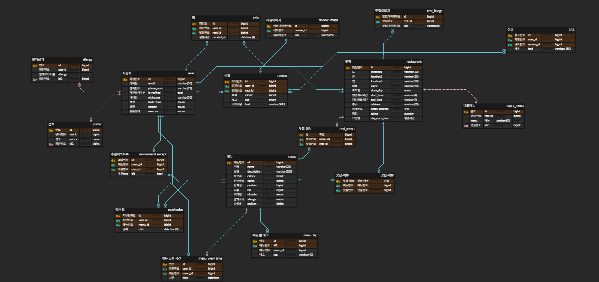

# omechu-server

## 🧁 오메추 프로젝트
**오늘의 메뉴를 색다르게! 사용자 응답 기반 메뉴 추천을 중심으로 먹을 거리 고민을 줄여주는 서비스, 오메추입니다!**

## 👯 팀원 정보
- umc node.js 8th **위니 김서진**
- umc node.js 8th **솔솔 노찬솔**
- umc node.js 8th **코크 문조원**
- umc node.js 8th **랄프 정휘준**

## 🛠 기술 스택
### Backend
- **Runtime**: Node.js
- **Framework**: Express.js
- **Language**: JavaScript (ES6+)
- **HTTP Status**: http-status-codes
- **API Documentation**: Swagger

### Database & Storage
- **Database**: MySQL
- **Cloud Storage**: AWS S3

### Development & Deployment
- **Version Control**: Git & GitHub
- **Cloud Platform**: AWS
- **Package Manager**: npm

### Architecture Pattern
- **Design Pattern**: MVC (Model-View-Controller)
- **API Design**: RESTful API
- **Code Organization**: Service-Oriented Architecture

## 브랜치 전략  : git flow 전략
```
main         ← 🔵 배포용 (실서비스 운영)
│
└── develop   ← 🟢 개발 통합 브랜치
    ├── feature/login-ui
    ├── feature/api-endpoint
    └── ...
```
## 📌 ERD 구조


## 🏗️ 서버 아키텍처

### 전체 시스템 구조
오메추 서버는 **3-Layer Architecture**를 기반으로 설계되어 있으며, AWS 클라우드 환경에서 운영됩니다.

```
Client (Frontend)
       ↓
[ Load Balancer ]
       ↓
[ Express.js Server ]
       ↓
┌─────────────────────────┐
│     Controller Layer    │ ← API 요청/응답 처리
├─────────────────────────┤
│      Service Layer      │ ← 비즈니스 로직 처리
├─────────────────────────┤
│       Data Layer        │ ← 데이터베이스 연동
└─────────────────────────┘
       ↓
[ MySQL Database ]
       ↓
[ AWS S3 Storage ]
```

### 계층별 역할

#### 1. **Controller Layer** (`controllers/`)
- **역할**: HTTP 요청/응답 처리, 라우팅
- **책임**: 
  - 클라이언트 요청 파라미터 검증
  - Service Layer 호출
  - HTTP 상태 코드 및 응답 형식 관리
  - 에러 핸들링
- **예시**: `sortMenu.controller.js`에서 메뉴 랜덤 추천, 검색, 필터링 API 처리

#### 2. **Service Layer** (`services/`)
- **역할**: 핵심 비즈니스 로직 구현
- **책임**:
  - 복잡한 데이터 처리 로직
  - 외부 API 호출
  - 데이터 변환 및 가공
  - 트랜잭션 관리
- **예시**: 메뉴 추천 알고리즘, 사용자 선호도 분석

#### 3. **Data Layer** (`models/` 또는 `repositories/`)
- **역할**: 데이터베이스 연동 및 데이터 액세스
- **책임**:
  - SQL 쿼리 실행
  - 데이터베이스 연결 관리
  - ORM/Query Builder 활용
  - 데이터 모델 정의

### 주요 기능별 아키텍처

#### 메뉴 추천 시스템
```
사용자 요청 → Controller → Service → 추천 알고리즘 → Database 조회 → 결과 반환
```

#### 이미지 관리 시스템
```
이미지 업로드 요청 → Controller → Service → AWS S3 업로드 → URL 반환 → Database 저장
```

#### 사용자 인증 시스템
```
로그인 요청 → Controller → Service → JWT 토큰 생성 → 미들웨어 검증
```

### 데이터베이스 설계
- **메뉴 테이블**: 메뉴 정보 및 이미지 링크 저장
- **사용자 테이블**: 사용자 정보 및 선호도 저장
- **조회 기록 테이블**: 사용자의 메뉴 조회 이력 추적
- **태그 테이블**: 메뉴 분류 및 필터링을 위한 태그 시스템

### API 설계 원칙
- **RESTful API**: 표준 HTTP 메서드 사용
- **일관된 응답 형식**: `resultType`, `error`, `success` 구조
- **에러 코드 체계**: 기능별 고유 에러 코드 (M001, M002, ...)
- **Swagger 문서화**: 모든 API 엔드포인트 문서화

### 보안 및 인증
- **JWT 토큰**: 사용자 인증 및 권한 관리
- **미들웨어**: 요청 검증 및 인증 처리
- **CORS**: 크로스 오리진 요청 관리
- **Input Validation**: 입력 데이터 검증 및 SQL Injection 방지

### 확장성 고려사항
- **마이크로서비스 지향**: 기능별 서비스 분리 가능한 구조
- **캐싱 전략**: Redis 도입 가능
- **로드 밸런싱**: AWS ELB를 통한 트래픽 분산
- **모니터링**: 로그 관리 및 성능 모니터링

## ⭐️ 브랜치(Branch) 컨벤션

1. **main** : 최종 배포를 위한 branch. Pull Request를 이용해 develope branch를 최종 merge
2. **develop** : 배포하기 전 개발 중일 때 각자의 브랜치에서 merge하는 브랜치 ( feature 브랜치나 refactor 브랜치 생성 후 PR 한 뒤 merge 는 무조건 **develop** 에 하기 )
3. **feat / #이슈 번호 / 기능명** : feature 브랜치. 새로운 기능 개발. 개발이 완료되면 develop 브랜치로 병합    ex)feat/#12/로그인 API 구현
4. **fix / #이슈 번호 / 기능명** : fix 브랜치. 생성 후 버그가 생겼을 때 수정하는 브랜치    ex)fix/#12/로그인 API 토큰 재발급
5. **refactor/#이슈 번호/기능명** : refactor 브랜치. 생성 후 버그가 생겼을 때 수정하는 브랜치  ex)refactor/#12/로그인 API 수정
6. **init/#이슈번호/기능명** : init 브랜치

---

## ⭐️ 코딩(Coding) 컨벤션

### 네이밍 컨벤션

-   **변수 / 함수 / 메서드** : Camel Case(카멜 케이스)
-   **컴포넌트** : Pascal Case(파스칼 케이스)

### 들여쓰기 컨벤션

-   **들여쓰기** : Tab

### 주석 컨벤션

-   **한 줄 주석** : //
-   **여러 줄 주석** : /\*\*/

---

## ⭐️ 이슈(Issue) 컨벤션

### 제목 :

**[Feat] 이슈 제목**

-   **기능 추가 시** : **[feat]** 로그인 기능 추가
-   **오류/ 버그 발생 시** : **[fix]** 로그인 오류 수정
-   **리팩토링 시** : **[refactor]** 로그인 페이지 리팩토링

### 내용

-   **feat** 일때:
    -   **작업한 내용** : 작업한 기능 작성 ( 예시 : 로그인 )
-   **fix** 일때:
    -   **발생한 오류** :
    -   **작업할 방향** :
-   **refactor** 일때:    ( **refactor 한 부분은 review 잘 달아주기** )
    -   **내용** : 리팩토링이 필요한 부분 입력
    -   **리팩토링 이유** : 과거 와 현재를 비교해서 작성해주기
    -   **리팩토링 결과** : 변경한 내용 입력
-   **init** 일때 :
    -   **내용** : 초기설정 한 내용
      
## ⭐️ PR(Pull Request) 컨벤션

### PR 제목

[Feat/#이슈 번호] " pr message "
(예시 : [Feat/#1] "로그인 기능 추가")

### 📌 관련 이슈번호

(Closes 키워드가 있어야 PR이 머지되었을 때 이슈가 자동으로 닫힌다)

-   Closes #이슈 번호

### 📌 PR 유형

어떤 변경 사항이 있나요?

-   [ ] 새 기능 추가
-   [ ] 버그 수정
-   [ ] CSS 등 사용자 UI 디자인 변경
-   [ ] 리팩토링

### 📌 PR 요약

해당 PR을 간단하게 요약해 주세요

### 📌 작업 세부 내용

1.
2.
3.

### 📸 스크린샷 (선택)

### 🔗 참고 자료

​

---

## ⭐️ 커밋(Commit) 컨벤션

      [Feat]: 커밋 메시지 타입
      (git commit -m “[Feat/#이슈 번호]: "commit messages”")


      (예시: git commit -m "feat:"회원 가입 기능 구현"" )

-   **커밋 메시지 타입 종류**

1. **init** : 프로젝트 초기 생성 및 설정
2. **feat** : 새로운 기능 추가, 기존의 기능을 요구 사항에 맞추어 수정
3. **fix** : 기능에 대한 버그 수정
4. **build** : 빌드 관련 수정
8. **refactor** : 기능의 변화가 아닌 코드 리팩터링 ex) 변수 이름 변경
   
## 협업 규칙

### Github 협업 규칙

Github 협업 규칙은 아래와 같습니다.

1. 전체적인 협업 flow는 Github flow를 따름.
2. Fork한 저장소를 각자 local로 가져와 수정.
3. 수정한 코드는 add -> commit -> push 후, upstream에 Pull Request를 수행.
4. main branch로부터 dev branch, prod branch를 구성.
5. 추가되는 기능에 대해서는 feature branch를 생성하여 각 기능별 branch를 구성.
6. Pull Request 시 Code Review 이후 Merge 진행.( **2명**의 review 를 받은 후에 review 에 맞게 수정한 후에 각자 자신의 PR 을 develop 에 merge 시키기 )
7. Commit 규칙은 아래와 같이 진행했습니다.

   | 커밋 타입 | 설명                                                           |
      | --------- | -------------------------------------------------------------- |
   | feature   | 새로운 기능 구현                                               |
   | fix       | 수정                                                          |
   | refactor  | 리팩토링                                                       |
   | init  | 프로젝트 초기 설정                                                       |
   
### Issue 활용
#### 이슈 작성 예시
#### ex) 제목 : [Feature] 로그인 API 개발
#### ex) 제목 : [Refactor] 로그인 API 수정
#### ex) 제목 : [Fix] 로그인 API 토큰 재발급 

- Github 레포지토리의 Issue탭에 Todo인 상황 혹은 In progress에 대한 상황을 작성하고 공유했습니다. 해당 Issue 번호로 각자의 로컬 레포지토리에 브랜치를 생성하여 Pull Request 시에 해당 Issue를 언급하여 공유했습니다. 해당 전략을 사용하여 Merge Conflict의 발생 가능성을 줄였습니다.

### PR 활용

- 다음과 같이 개발 이후 특정 프로젝트에 대한 변경사항을 제안하고, 팀원과 이를 검토 및 논의한 후, 최종적으로 해당 변경사항을 반영할 수 있도록 했습니다.
- 다른 개발자들은 해당 Pull Request를 검토하고, 필요한 경우 피드백을 제공할 수 있었습니다.
- 검토 후, Pull Request가 승인되면 변경 사항이 메인 프로젝트로 병합되도록 했습니다. 반면, 추가적인 수정이 필요한 경우 개발자는 피드백을 반영하여 수정하고, 수정된 변경사항을 다시 push 했습니다.

### 아키텍쳐 사진

